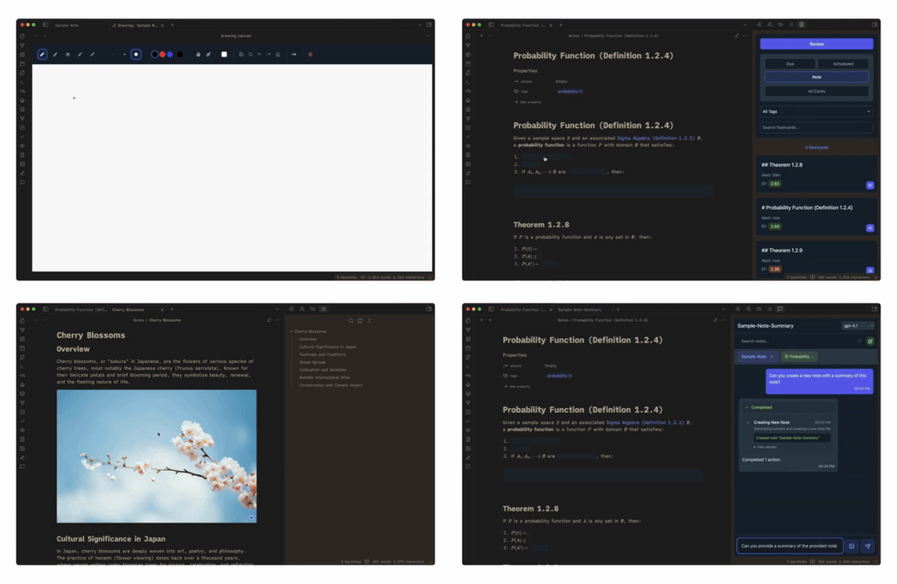
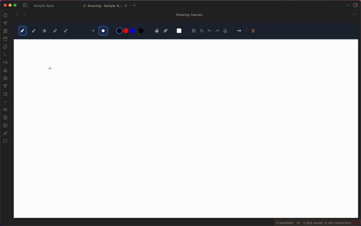
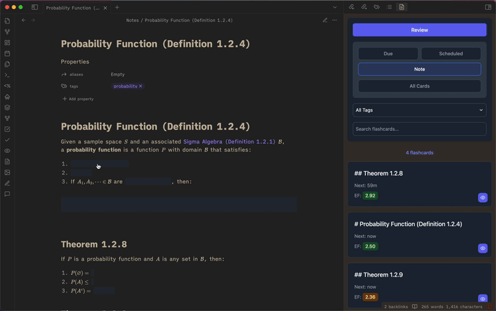
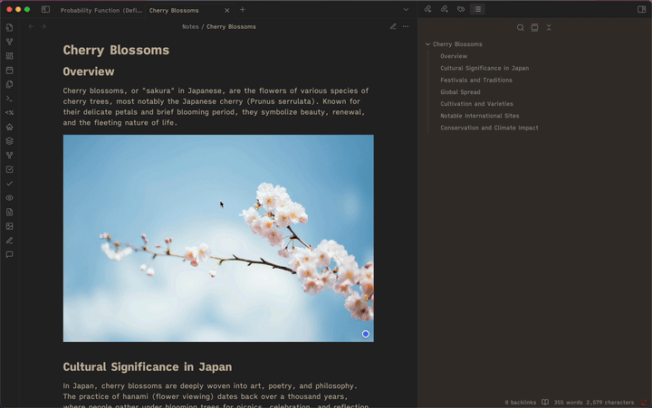
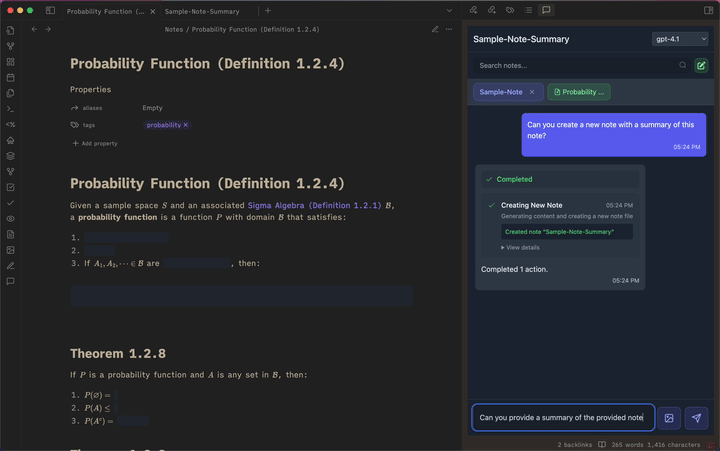
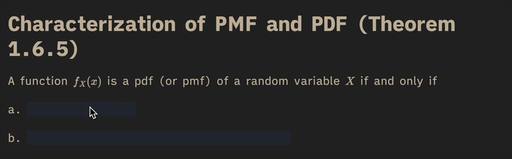
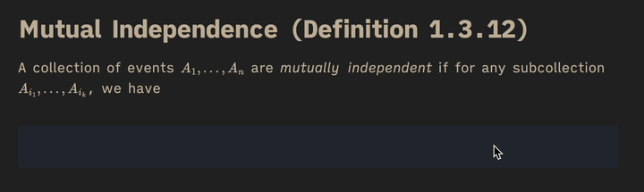
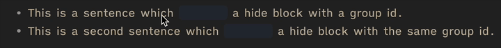
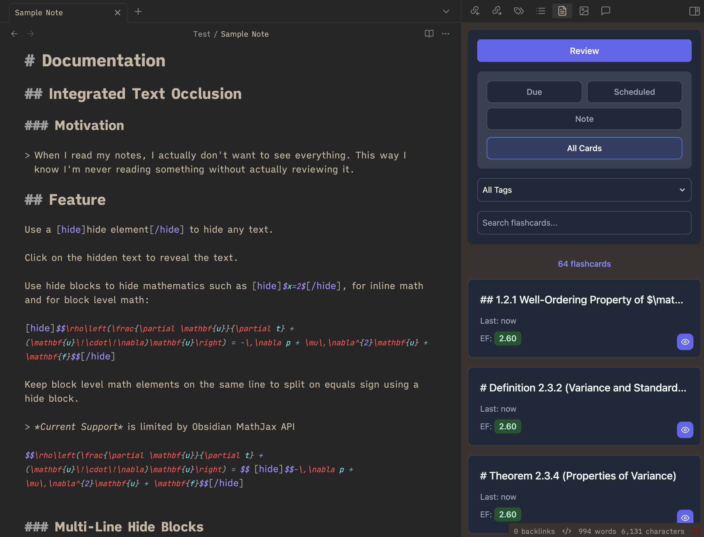
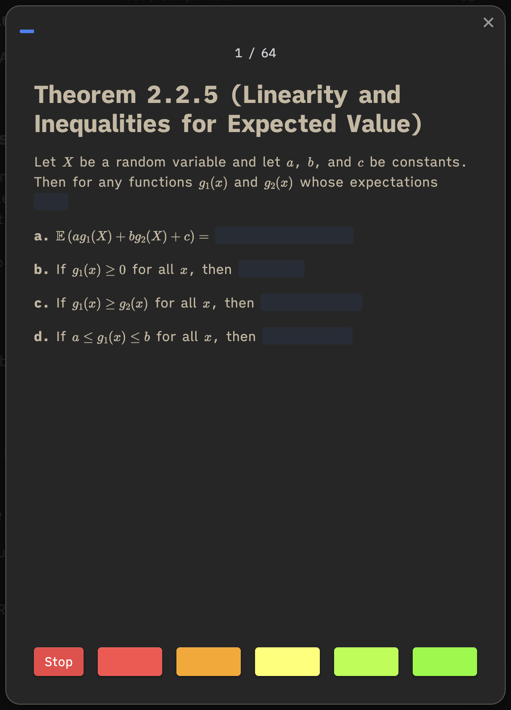

## Sample Note Beta (0.1.22)



I've always loved Obsidian and have been a supporter from nearly the beginning, but I found it tedious to synchronize my notes with other forms of learning programs such as Anki, GoodNotes, etc.

To remedy this, I've created a plugin to make Obsidian my single source of truth by replicating my favourite features from all different kinds of learning tools.

I hope you enjoy.

-   Bryce

## Features

## GoodNotes Style Handwriting

Take handwritten notes in Obsidian using a similiar set of tools as GoodNotes.



### Integrated Text Occlusion & Flashcards

Easily create flashcards directly within Obsidian your content without having to export or sync to Anki.



## Integrated Image Occlusion



## Flashcard Graph


## Copilot Chat Assistant



## Installation

### Installing from GitHub

1. **Download the plugin files**

    - Go to the [Releases page](https://github.com/bryce-davidson/sample-note/releases) on GitHub
    - Download the latest release files (`main.js`, `manifest.json`, and `styles.css`)

2. **Locate your Obsidian vault's plugins folder**

    - Open Obsidian and go to Settings → Community plugins
    - Click on the folder icon next to "Installed plugins" to open your vault's plugins folder
    - Alternatively, navigate to: `YourVault/.obsidian/plugins/`

3. **Install the plugin**

    - Create a new folder called `sample-note` in the plugins folder
    - Copy the downloaded files (`main.js`, `manifest.json`, and `styles.css`) into this folder

4. **Enable the plugin**
    - Go back to Obsidian Settings → Community plugins
    - Reload Obsidian or click the reload button
    - Find "Sample Note Beta" in the list and toggle it on

# Documentation

## Integrated Text Occlusion

### Motivation

> When I read my notes, I actually don't want to see everything. This way I know I'm never reading something without actually reviewing it.

## Feature

Wrap text in a `[hide][/hide]` element to hide the text.


Click on the hidden text to reveal the text.

Use hide blocks to hide both inline and block level math.





### Hide Groups

Use hide groups to synchronize show/hide functionality across different hide blocks by assigning a **numerical** id to the hide block:

```markdown
-   This is a sentence which [hide=1]contains[/hide] a hide block with a group id.
-   This is a second sentence which [hide=1]contains[/hide] a hide block with the same group id.
```



## Image Occlusion

Add occlusions to images in your vault using the occlusion editor.

### Occlusion Editor

Double click on preview images to open them in the occlusion editor, or search and select them using the attachment search box.

### Preview Occlusions

Images with Occlusions which have been inserted as a preview using `![[]]` will appear with the occlusions added to the image in rendered markdown.

Click on the small circular blue button in the bottom right of the image to enable revealing the occlusion shapes by clicking on them. The button will turn green indicating that the occlusions can be clicked to reveal the image behind them.

Click on the now small circular green button to reset all occlusion shapes.

### Adding Occlusions

Click on the "+" button to add an occlusion onto the image.

#### Quick Add Occlusion

Enable the "Quick Add" option to add occlusions by dragging and releasing them to add them onto the image.

## HideOne/Hide All

With one or multiple occlusions selected, click on either "HideAll" or "HideOne" to create a flashcard which just contains the image and the selected occlusions.

-   HideAll
    -   Selected Occlusions will be able to be toggled, while all other occlusions will be permanant.
-   HideOne
    -   Selected Occlusions will be able to be toggled, while all other occlusions will not be present.

#### Keyboard/Mouse Controls

-   Scroll wheel - zoom in/out
-   Hold space - enable drag
-   Shift Click - select multiple occlusions
-   ctrl+z - Undo
-   ctrl+shift+z - Redo

## Flashcards

Create flashcards by wrapping content within a card element.

```markdown
[card]
Flashcards appear in the [hide]"Review Queue"[/hide]
[/card]
```

## Review Queue

Open the review queue using the "Review Queue" ribbon icon to see all flashcards within your vault.



Flashcards in the Review Queue are scheduled using the same SM-2 algorithm used in Anki.

#### Filter Options

-   Due
    -   Shows all due flashcards
-   Scheduled
    -   Shows all upcoming flashcards which are not due
-   Note
    -   Shows all flashcards in current note
-   All Cards
    -   Shows all flashcards

### Flashcard Modal

Upon clicking on the review button in the "Review Queue", flashcards will appear in the flashcard modal.

Click on one of the five rating buttons to input your easyness-factor rating.



## Desired Features

-   Front/Back Style Cards

## Flashcard Graph View

Open the Flashcard Graph View to see the Easyness Factor (EF) rating for all flashcards in your connected notes.


### Controls

Use the controls to change the visual appearance of the graph and modify the animation.

#### Graph Controls

-   Edge
-   Charge
-   Card Offset Distance
-   Card Size
-   Text Color

#### Animation Controls

-   Play/Pause
-   Start/End
-   Click on the timeline to track to a location
-   Speed of animation
-   Group by events by specific time intervals

#### Animation Grouping

-   None
-   Hour
-   Day
-   Week

## Drawings/Hand Written Notes

Open the drawing editor using the pencil ribbon icon.


Drawings are linked directly to notes, as indicated by the title preview of the associated tab.

Drawing view can be toggled to be either in the sidebar or a main view by using the associated control.

### Controls

#### Tools

##### Drawing Tools

-   Pen Brush
-   Handwriting Brush
-   Eraser Brush
-   Highlighter Brush
-   Freehand Selection Brush
-   Size Select
-   Color Select

#### Canvas Modes/Controls

##### Modes

-   Pan Mode
-   Stylus Only Mode (Excellent for when on a tablet)

##### Controls

-   Background Color Select
-   Save Button
-   Return to Home View Button
-   Undo Button
-   Redo Button
-   Set Home View Button
-   Toggle Sidebar/Main View
-   Clear Canvas

### Desired Features

-   Lined pages
-   Obsidian native links

## Chat Assistant

Use the chat editor to interact with your documents, and accomplish tasks such as creating new notes. Ask questions based on the context provided to the chat assistant.

Select from one the most up to date OpenAI models.

Use the context controls to control what chatGPT sees.


### Demos

-   make me a practice test on this material
-   Make me a new flashcard on this material
-   grade my practice test

## Desired Features

-   Drawing view integration
-   Prompt Basket Buttons
