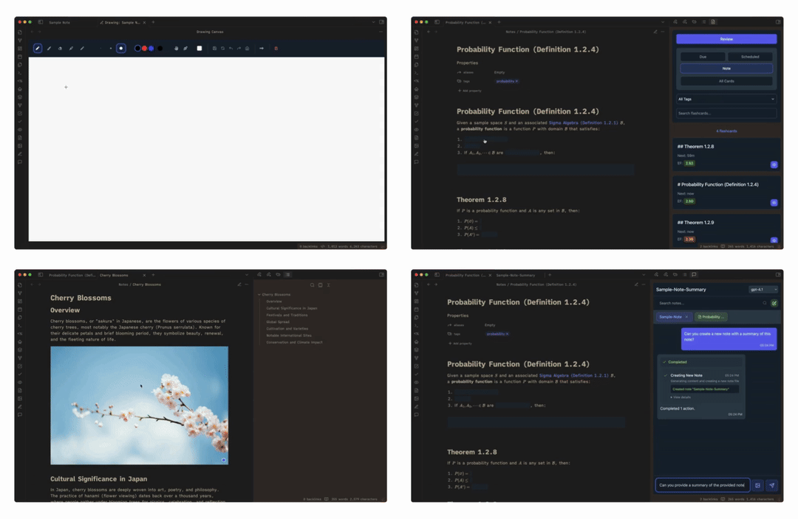
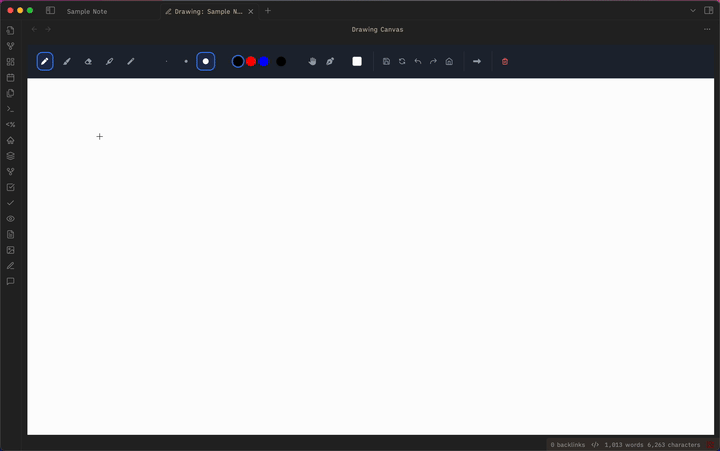
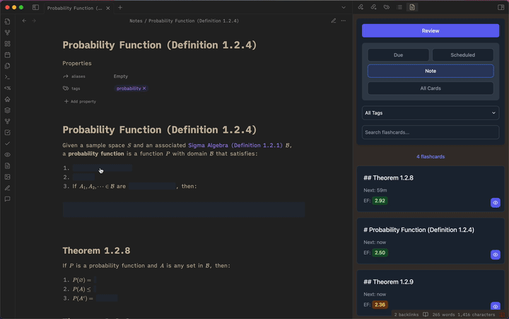
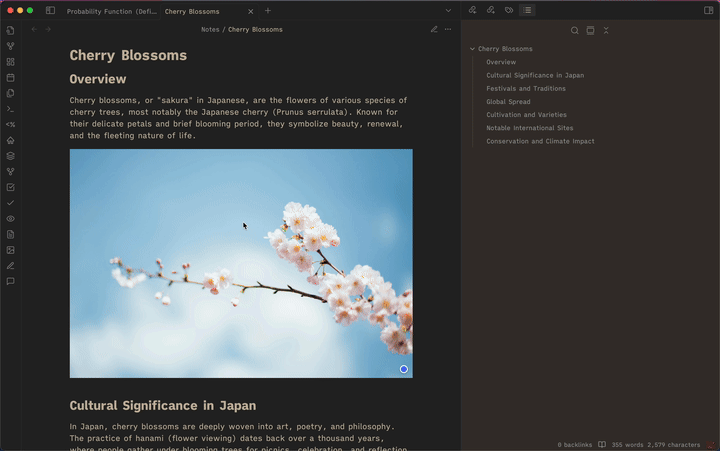
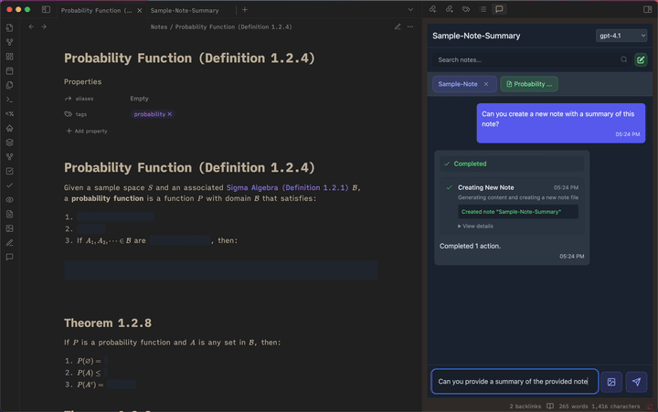

## Sample Note Beta (0.1.22)



I've always loved Obsidian and have been a supporter from nearly the beginning, but I found it tedious to synchronize my notes with other forms of learning programs such as Anki, GoodNotes, etc.

To remedy this, I've created a plugin to make Obsidian my single source of truth by replicating my favourite features from all different kinds of learning tools directly in Obsidian.

I hope you enjoy.

-   Bryce

## Features

## GoodNotes Style Handwriting

Transform your Obsidian notes with natural handwriting support, featuring a familiar and intuitive drawing interface inspired by GoodNotes. Perfect for tablet users and those who prefer handwritten notes.



### Integrated Text Occlusion & Flashcards

Create and manage flashcards seamlessly within Obsidian, eliminating the need for external flashcard applications. Hide and reveal text to test your knowledge directly in your notes, or using the built in flashcard review tray.



### Quick Access

The following ribbon icons are available for quick access to flashcard features:

-   **Layers Icon**: Review all due flashcards
-   **Check Square Icon**: Review flashcards in the current note
-   **Check Icon**: Review all flashcards
-   **Eye/Eye-off Icon**: Toggle visibility of all hidden content
-   **File Text Icon**: Open the review queue

### Available Commands

-   **Wrap Selected Text in [card][/card]**: Wraps the selected text or current line in flashcard tags
-   **Delete [card][/card] wrappers**: Removes flashcard tags from the current selection
-   **Delete all [card][/card] wrappers**: Removes all flashcard tags from the current note
-   **Review Current Note**: Opens the flashcard review modal for the current note
-   **Review All**: Opens the flashcard review modal for all due flashcards
-   **Resync Flashcards in Current Note**: Resynchronizes flashcards in the current note
-   **Synchronize All Cards in Vault**: Resynchronizes all flashcards across the vault

## Integrated Image Occlusion

Enhance your learning with interactive image occlusions. Create custom masks over images and review them as standalone flashcards, perfect for studying diagrams, maps, and visual concepts.



### Quick Access

The following ribbon icon is available for quick access to the occlusion editor:

-   **Image File Icon**: Open the occlusion editor

### Available Commands

-   **Wrap Selected Text in [hide][/hide]**: Wraps the selected text or current line in hide tags
-   **Wrap in multiline hide [hide][/hide]**: Wraps the selected text or current line in a multiline hide block
-   **Delete [hide][/hide] wrappers**: Removes hide tags from the current selection
-   **Toggle All Hidden Content**: Shows or hides all hidden content in the current note
-   **Open Occlusion Editor**: Opens the image occlusion editor

### Occlusion Editor

Double click on preview images to open them in the occlusion editor, or search and select them using the attachment search box.

### Preview Occlusions

Images with Occlusions which have been inserted as a preview using `![[]]` will appear with the occlusions added to the image in rendered markdown.

Click on the small circular blue button in the bottom right of the image to enable revealing the occlusion shapes by clicking on them. The button will turn green indicating that the occlusions can be clicked to reveal the image behind them.

Click on the now small circular green button to reset all occlusion shapes.

### Adding Occlusions

Click on the "+" button to add an occlusion onto the image.

#### Quick Add Occlusion

Enable the "Quick Add" option to add occlusions by dragging and releasing them to add them onto the image.

## HideOne/Hide All

With one or multiple occlusions selected, click on either "HideAll" or "HideOne" to create a flashcard which just contains the image and the selected occlusions.

-   HideAll
    -   Selected Occlusions will be able to be toggled, while all other occlusions will be permanant.
-   HideOne
    -   Selected Occlusions will be able to be toggled, while all other occlusions will not be present.

#### Keyboard/Mouse Controls

-   Scroll wheel - zoom in/out
-   Hold space - enable drag
-   Shift Click - select multiple occlusions
-   ctrl+z - Undo
-   ctrl+shift+z - Redo

## Flashcards

Create flashcards by wrapping content within a card element.

```markdown
[card]
Flashcards appear in the [hide]"Review Queue"[/hide]
[/card]
```

## Review Queue

Open the review queue using the "Review Queue" ribbon icon to see all flashcards within your vault.

Flashcards in the Review Queue are scheduled using the same SM-2 algorithm used in Anki.

#### Filter Options

-   Due
    -   Shows all due flashcards
-   Scheduled
    -   Shows all upcoming flashcards which are not due
-   Note
    -   Shows all flashcards in current note
-   All Cards
    -   Shows all flashcards

### Flashcard Modal

Upon clicking on the review button in the "Review Queue", flashcards will appear in the flashcard modal.

Click on one of the five rating buttons to input your easyness-factor rating.

## Flashcard Graph View

Open the Flashcard Graph View to see the Easyness Factor (EF) rating for all flashcards in your connected notes.

### Available Commands

-   **Open Graph View**: Opens the flashcard graph visualization
-   **Open Unified Queue**: Opens the review queue sidebar

### Controls

Use the controls to change the visual appearance of the graph and modify the animation.

#### Graph Controls

-   Edge
-   Charge
-   Card Offset Distance
-   Card Size
-   Text Color

#### Animation Controls

-   Play/Pause
-   Start/End
-   Click on the timeline to track to a location
-   Speed of animation
-   Group by events by specific time intervals

#### Animation Grouping

-   None
-   Hour
-   Day
-   Week

## Drawings/Hand Written Notes

Open the drawing editor using the pencil ribbon icon.

Drawings are linked directly to notes, as indicated by the title preview of the associated tab.

Drawing view can be toggled to be either in the sidebar or a main view by using the associated control.

### Quick Access

The following ribbon icon is available for quick access to the drawing canvas:

-   **Pencil Icon**: Open the drawing canvas

### Available Commands

-   **Open Drawing Canvas**: Opens the drawing canvas

### Controls

#### Tools

##### Drawing Tools

-   Pen Brush
-   Handwriting Brush
-   Eraser Brush
-   Highlighter Brush
-   Freehand Selection Brush
-   Size Select
-   Color Select

#### Canvas Modes/Controls

##### Modes

-   Pan Mode
-   Stylus Only Mode (Excellent for when on a tablet)

##### Controls

-   Background Color Select
-   Save Button
-   Return to Home View Button
-   Undo Button
-   Redo Button
-   Set Home View Button
-   Toggle Sidebar/Main View
-   Clear Canvas

## Math Support

The plugin includes special support for mathematical content, making it easier to create flashcards from mathematical equations and formulas.

### Available Commands

-   **Split Math Block on Equals Sign**: Splits a math block at the equals sign to create a flashcard

## Chat Assistant

Use the chat editor to interact with your documents, and accomplish tasks such as creating new notes. Ask questions based on the context provided to the chat assistant.

Select from one the most up to date OpenAI models.

Use the context controls to control what chatGPT sees.

### Quick Access

The following ribbon icon is available for quick access to the chat assistant:

-   **Message Square Icon**: Open the chat assistant

### Available Commands

-   **Open Chat Assistant**: Opens the AI chat assistant

### Demos

-   make me a practice test on this material
-   Make me a new flashcard on this material
-   grade my practice test

## Copilot Chat Assistant

Fill the context of ChatGPT with your noted to create, edit and ask questions of your notes. Generate practice tests, create flashcards, and get instant feedback on your learning materials, all within Obsidian.



### Quick Access

The following ribbon icon is available for quick access to the chat assistant:

-   **Message Square Icon**: Open the chat assistant

### Available Commands

-   **Open Chat Assistant**: Opens the AI chat assistant

### Demos

-   make me a practice test on this material
-   Make me a new flashcard on this material
-   grade my practice test

# Road Map

The following features are planned for future releases:

## Flashcard Features

-   Front/Back Style Cards

## Drawing Features

-   Lined pages
-   Obsidian native links

## Chat Assistant Features

-   Drawing view integration
-   Prompt Basket Buttons
